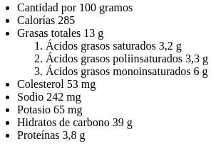
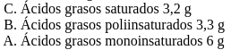
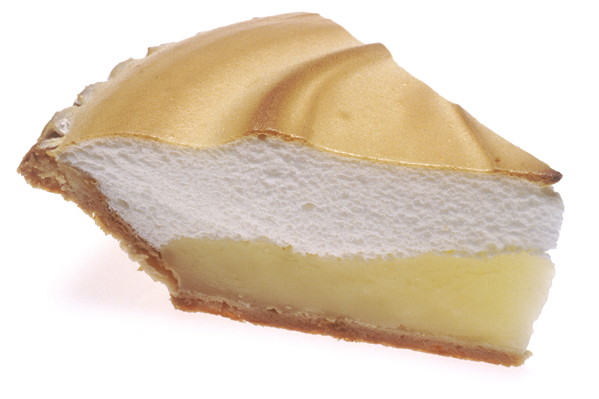

# Type of lists

We can use `<ul>` label to create "unordered lists". Each element inside these lists would be labeled with `<li>` to create a text string text sequence but not ordered by numbers.

Unordered lists are usually used to create navigation menus.

Also, we can create ordered (numbered) lists using `<ol>` label.

This has a magnitude sense of order given by numbers, useful to make an imortance statement sequence.

In both cases, lists **can be nested into other lists**. When we do so, have to be alert about closing correct labels in correct order.

Here are a pair of examples. First, **unordered list**:

 ```
<ul>
<li>Text 1</li>
<li>Text 2</li>
<li>Text 3</li>
</ul>
```
And this is how this HTML text looks like:

<ul>
<li>Text 1</li>
<li>Text 2</li>
<li>Text 3</li>
</ul>

Now, an **ordered list** example:

```
<ol>
<li>Text 1</li>
<li>Text 2</li>
<li>Text 3</li>
</ol>
```

And this is how it looks like, too:

<ol>
<li><strong>this is</strong></li>
<li>an ordered</li>
<li>...list.</li>
</ol>

Now I would like to show a nested list example, so we can have an idea of the whole possibilities:

```
<ul>
  <li>Cantidad por 100 gramos</li>
  <li>Calorías 285</li>
  <li>Grasas totales 13 g
    <ol>
      <li>Ácidos grasos saturados 3,2 g</li>
      <li>Ácidos grasos poliinsaturados 3,3 g</li>
      <li>Ácidos grasos monoinsaturados 6 g</li>
    </ol>
  </li>
  <li>Hidratos de carbono 39 g</li>
  <li>Proteínas 3,8 g</li>
</ul>
```
Its important to say I'm not sure if it is possible to create an ordered list nested into an unordered one, or vice versa.

Possibly this nested list won't look well in an .md file.

It is important to say,also,  that here we are talking about *meringue lemon cake* ingredients...xd!  

Here is how it would be appearing:



We can use the atribute *type* in an ordered lists to specify if we want a letter based lists instead of numbers, and if we want a reversed list we should add the instruction *reversed* as well:

```
<ol type="A" reversed>
  <li>Ácidos grasos saturados 3,2 g</li>
  <li>Ácidos grasos poliinsaturados 3,3 g</li>
  <li>Ácidos grasos monoinsaturados 6 g</li>
</ol>
```
This would be the result of doing so:




To finish, I would like to share an image of the cake, because we have been indirectly talking about it you know?


